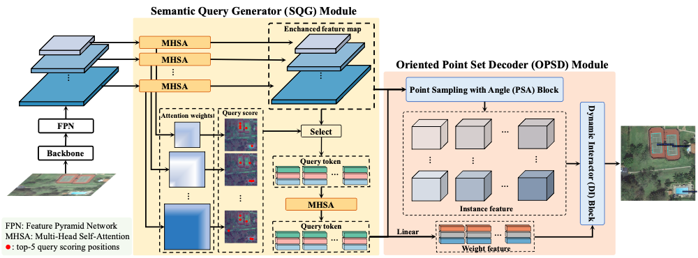
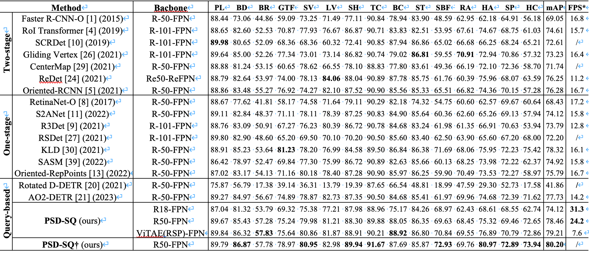

# PSD-SQ: Point Set Decoding Based on Semantic Query for Object Detection in Remote Sensing Images

Official implentation of PSD-SQ. 

Our code is build upon [mmrotate](https://github.com/open-mmlab/mmrotate.git) 1.x branch, please follow its [installation](https://mmrotate.readthedocs.io/en/1.x/get_started.html) doc to setup the Python enviroment.

## Abstract

Object detection in remote sensing images (RSIs) remains a challenging task due to complex variations in object scale, dense arrangements, and arbitrary orientations. Comp- ared to the widely-used multi-stage and one-stage approaches, query-based methods that avoid post-processing procedures and implement end-to-end inference, have recently attracted much attention. However, existing query-based methods still face two main challenges: 1) The feature sampling regions predicted by the query vectors often fail to be aligned with the foreground features, making it difficult to accurately classify and locate potential objects; 2) The cascade decoders are crucial for optimizing the query vectors, resulting in a slower inference process. To address the above issues, we propose a novel object detection method named point set decoding based on semantic query (PSD-SQ), which mainly consists of two components: a semantic query generator (SQG) module and an oriented point set decoder (OPSD) module. The SQG module is proposed to generate semantic query vectors with rich object information based on the semantic correlations among feature vectors. The OPSD module includes two blocks: a point sampling with angle (PSA) block and a dynamic interactor (DI) block. The PSA block is constructed to refine the sampling locations with predicted angle, aligning the sampling locations and oriented object regions, and the DI block is designed to decode the sampled features with dynamic weights, making the decoding process more efficient. The proposed method is extensively evaluated on various object detection datasets of RSIs, and the experimental results consistently demonstrate that the proposed method achieves state-of-the-art performance in terms of both accuracy and inference speed.

## Model Structure



## Experimental Results



# Citation
If you find this work is useful, please kindly cite:
```
@ARTICLE{10387417,
  author={Feng, Shiyang and Wang, Bin},
  journal={IEEE Transactions on Geoscience and Remote Sensing}, 
  title={PSD-SQ: Point Set Decoding Based on Semantic Query for Object Detection in Remote Sensing Images}, 
  year={2024},
  doi={10.1109/TGRS.2024.3352011}}
```
